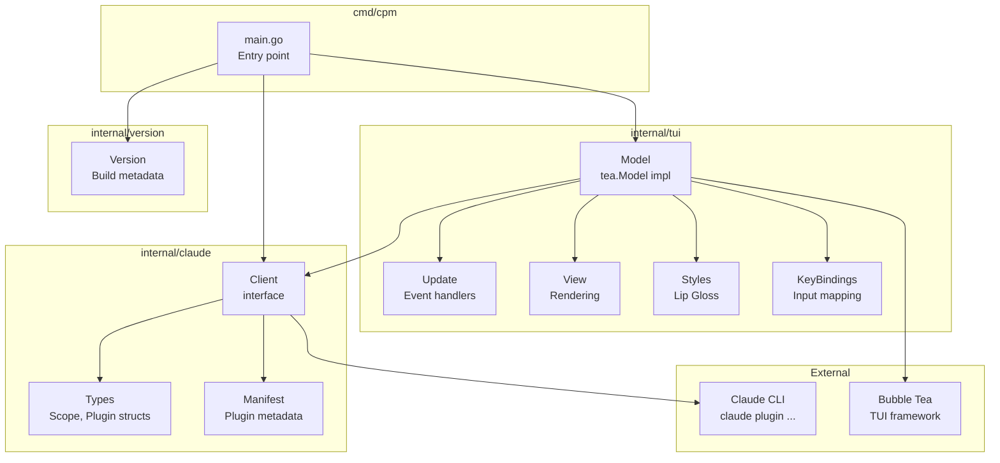
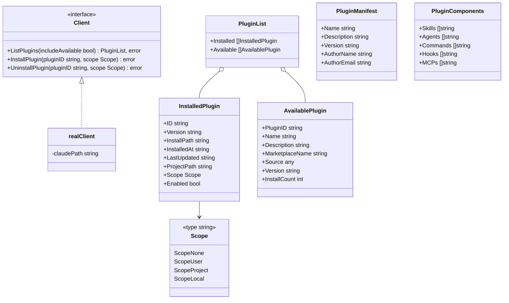
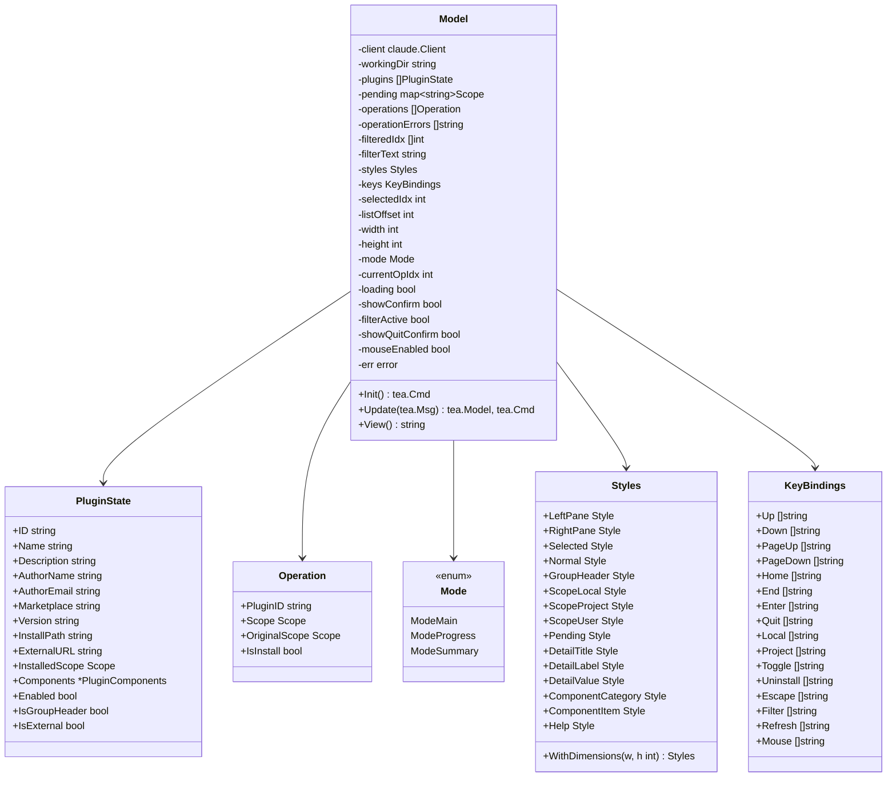
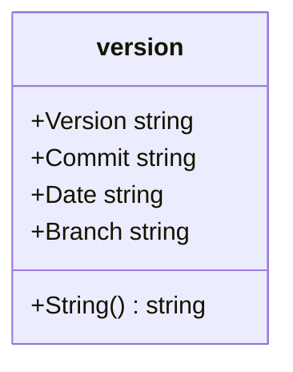
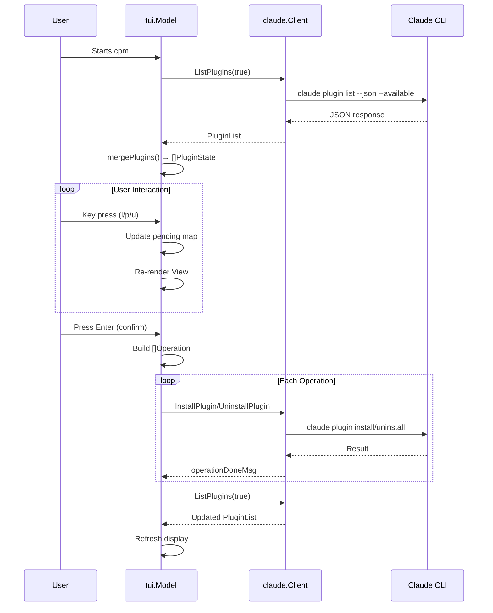
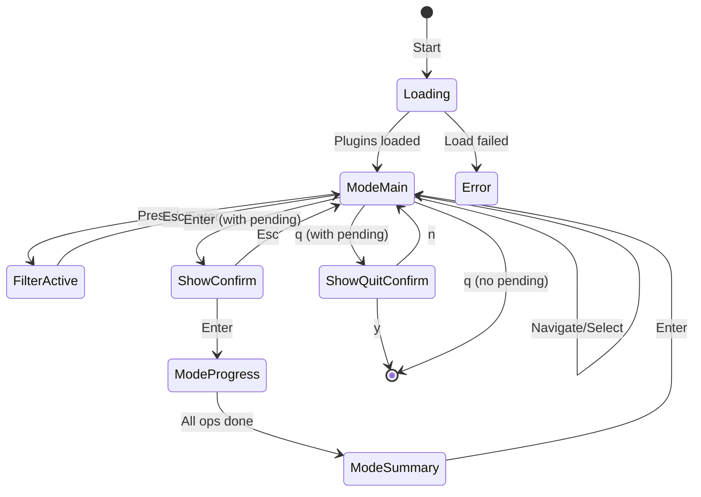

# CPM Architecture

Last updated: 2026-01-23

This document describes the architecture of cpm (Claude Plugin Manager), a TUI application for managing Claude Code plugins.

## Package Overview



## Package Details

### cmd/cpm

Entry point that:
- Parses command-line arguments (`--version`, `--help`)
- Creates a `claude.Client` instance
- Creates a `tui.Model` with the client and working directory
- Runs the Bubble Tea program

### internal/claude

Claude CLI wrapper providing:



**Key functions:**
- `ReadPluginManifest(installPath)` - Reads plugin.json for metadata
- `ScanPluginComponents(installPath)` - Scans directories for skills, agents, etc.
- `ResolveMarketplaceSourcePath(marketplace, source)` - Resolves marketplace plugin paths

### internal/tui

Bubble Tea TUI implementation using the Elm Architecture:



**Messages:**
- `pluginsLoadedMsg` - Plugins loaded from CLI
- `pluginsErrorMsg` - Error loading plugins
- `operationDoneMsg` - Install/uninstall completed

### internal/version

Build-time metadata set via ldflags:



## Data Flow



## UI States



## File Structure

```
cpm/
├── cmd/cpm/
│   └── main.go              # Entry point
├── internal/
│   ├── claude/
│   │   ├── client.go        # CLI wrapper
│   │   ├── manifest.go      # Manifest reading
│   │   └── types.go         # Data structures
│   ├── tui/
│   │   ├── model.go         # Model + state
│   │   ├── update.go        # Event handlers
│   │   ├── view.go          # Rendering
│   │   ├── styles.go        # Lip Gloss styles
│   │   └── keys.go          # Key bindings
│   └── version/
│       └── version.go       # Build metadata
└── docs/
    └── architecture.md      # This file
```
